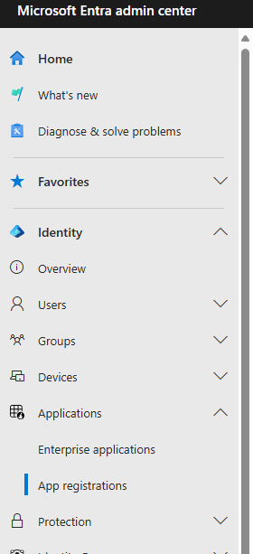
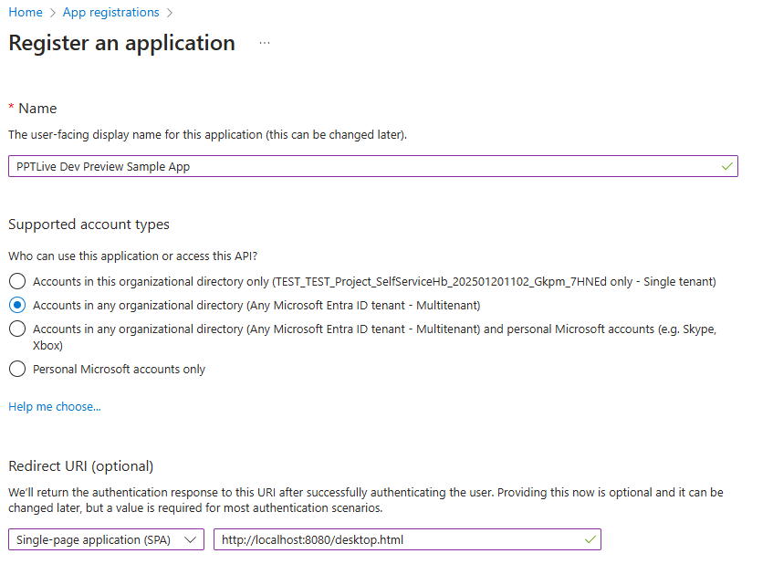
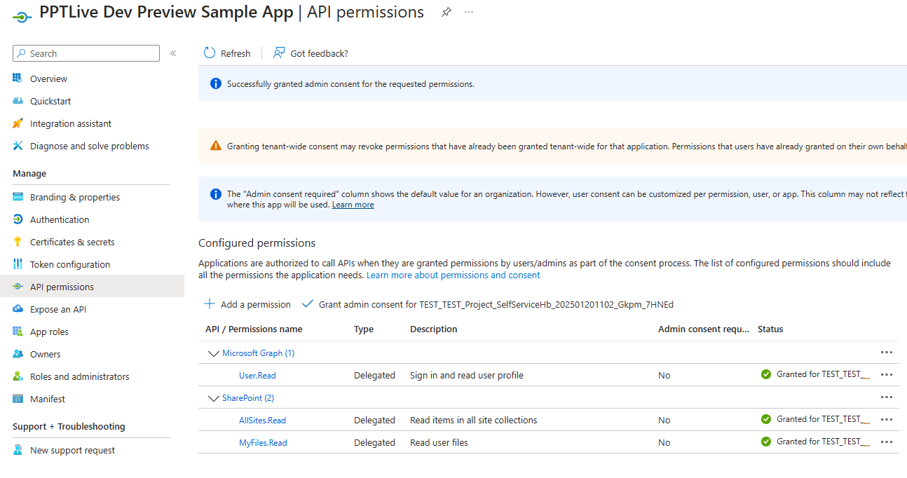

# Present-live Sample Integration App

The present-live experience is currently available for dev preview in the [MDCPP npm package](https://aka.ms/MDCPP-npm-package). This sample app demonstrates how to use the MDCPP npm package to integrate this experience.

The present-live experience allows meeting participants to interact and collaborate using PowerPoint Live directly in your collaboration app. For more about the present-live experience and how to implement it in your app, see [Integrate present-live experiences in the Microsoft 365 Document Collaboration Partner Program](https://learn.microsoft.com/microsoft-365/document-collaboration-partner-program/scenarios/present).

> **IMPORTANT**:
>
> - You must be a member of the Microsoft 365 Document Collaboration Partner Program in order to access MDCPP services.
> - For the dev preview, don't use any Microsoft 365 accounts that contain real user data. Data for this experience is being hosted on development endpoints.

## Set up

Follow these instructions to configure a sample app in your test tenant.

1. Sign in to the Entra admin center with your test tenant admin account: https://entra.microsoft.com/
1. Expand the **Applications** tab and open the **App registrations** page.

    

1. Select **New registration** and give your sample app a name.
1. Select **Accounts in any organizational directory (Any Microsoft Entra ID tenant - Multitenant)** under **Supported account types**.
1. Add an SPA redirect URI pointing to http://localhost/desktop.html as shown in the following screenshot.

   

1. Select **Register**.
1. Choose the **API permissions** tab on your sample app's registration page.
1. Select **Add a permission** > **SharePoint** > **Delegated permissions**.
1. Ensure that **AllSites.Read** and **MyFiles.Read** permissions are selected. Select **Add permissions**.
1. Select **Grant admin consent for \<tenant-name\>** (where \<tenant-name\> is the name of your test tenant) then choose **Yes** in the subsequent popup dialog. Your registration page should look similar to the following screenshot.

   

1. Ensure that your test user account's OneDrive files contain at least one PowerPoint slide deck for testing.

   > **Note**: You can create a sample PowerPoint presentation file at https://m365.cloud.microsoft/create.

## Run the sample app locally

1. Fork this repo then clone your fork locally.
1. Navigate to and open the root directory of the sample **present-live-integration-app-sample**.
1. Create a new file named **.env** in the sample's root directory.
1. Open the .env file in your preferred code editor.
1. Add the following line to the .env file, replacing "[your Entra client ID]" with your Entra sample app's client ID. You can find the ID by navigating to the **Overview** tab in your app's registration page, listed under **Application (client) ID** in the **Essentials** dropdown menu near the top of the page.

   ```text
   ENTRA_APPID = [your Entra client ID]
   ```

1. In a terminal, run the following command from the sample's root directory to download dependencies.

   ```text
   yarn
   ```

   1. If you don't have yarn, you can download it by running the following command.

      ```text
      npm i -g yarn
      ```

   1. If you don't have Node.js, you can download it from https://nodejs.org/en/download.

1. Run the following command to launch the sample app. Ensure that port 8080 is free.

   ```text
   yarn start
   ```

1. In a private or incognito browser window, navigate to the following URL. To avoid issues with signing in, it's recommended to do this in a private or incognito browser window in case you're already signed in with a different Entra account in that browser.

   ```text
   http://localhost:8080/desktop.html
   ```

1. Sign in with your test Entra account. You may need to accept a **Permissions requested** dialog. After a few seconds, the file picker UI should load.
1. Select your test PowerPoint file from the file picker.
1. Choose **Present** at the bottom right.

A new browser tab should open that contains the attendee view. The initial browser tab will contain the presenter view. You may need to allow browser popups to see the new attendee tab.

## Using HTTPS

The MDCPP endpoints require the host app to support HTTPS for security. Please ensure your app is served using HTTPS. There are many ways to achieve this depending on your setup. Here are two methods that aren't specific to this program that use open source or free software.

### Method 1: Ngrok

1. Install and setup [ngrok](https://ngrok.com/download).
1. Create an account on ngrok.com.
1. Run `ngrok config add-authtoken [your auth token]`.
1. Run `ngrok http 8080` and copy the Forwarding URL from terminal.
1. Go to the [Azure App registrations page](https://aka.ms/AppRegistrations/?referrer=https%3A%2F%2Fdev.onedrive.com) and add the Forwarding URL to the list of approved Redirect URLs.
1. Follow instructions to run the present-live test app on localhost.
1. Open the app using the Forwarding URL.

### Method 2: mkcert (No need to add Redirect URL to registered App)

1. Install [mkcert](https://github.com/FiloSottile/mkcert).
1. Run `mkcert localhost 127.0.0.1` to generate a certificate for the host you are using locally. The output should show the path to the generated cert and key.
1. Open the webpack.config.js file in this repo's root directory and add the [devServer](https://webpack.js.org/configuration/dev-server/#devserverserver) configs to use the generated files.

  ```text
  devServer: {
    server: {
      type: 'https',
      options: {
        ca: './path/to/server.pem',
        pfx: './path/to/server.pfx',
        key: './path/to/server.key',
        cert: './path/to/server.crt',
        passphrase: 'webpack-dev-server',
        requestCert: true,
      },
    },
  },
  ```

1. You can find the path to the CA by running `mkcert -CAROOT`.
1. Start the present-live test app using localhost.
